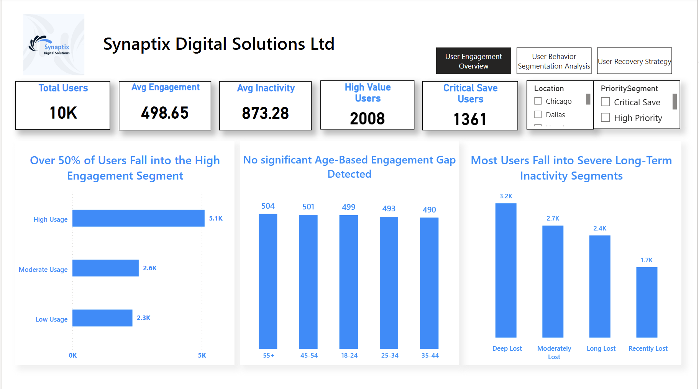
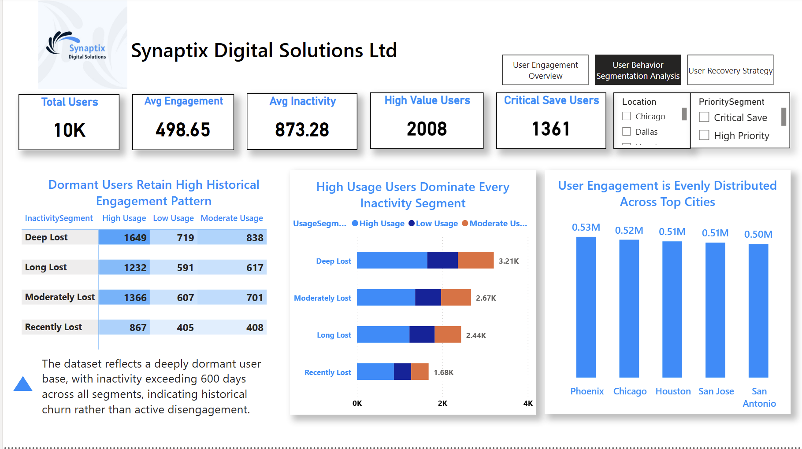
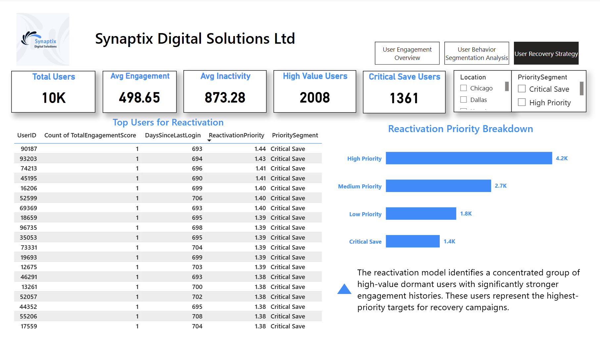

# 🔄 User Reactivation Analysis

SQL + Power BI Project | 10,000 Dormant Users | Synaptix Digital Solutions Ltd

## 📚 Table of Contents
- [Project Overview](#project-overview)
- [Tools & Technologies](#tools--technologies)
- [Dataset Breakdown](#dataset-breakdown)
- [Dashboard Walkthrough](#dashboard-walkthrough)
- [Key Insights & Findings](#key-insights--findings)
- [Recommendations](#recommendations)

---

## Project Overview

This project analyses a fully dormant user base of 10,000 users — all inactive 
for over 600 days — for Synaptix Digital Solutions Ltd. The goal was not 
traditional churn analysis but targeted recovery strategy: identifying which 
users are worth reactivating, segmenting them by value and priority, and 
delivering a ranked list of reactivation targets for the marketing and 
product teams.

The analysis was built as a three-page interactive Power BI report moving 
from high-level engagement overview, to behavioural segmentation, to 
actionable recovery strategy — with SQL used for data extraction and 
transformation prior to visualisation.

This project was completed as the capstone for the RKY Careers CPD Accredited 
Data Analyst and Business Intelligence Analyst Bootcamp, where I served as 
team lead — coordinating delivery, supporting team members and presenting 
findings to invited stakeholders.

---

## Tools & Technologies

- SQL — data extraction and transformation
- Power BI — interactive dashboard and report design
- DAX — measures and KPIs
- Power Query — data cleaning and preparation

---

## Dataset Breakdown

- 10,000 users — all with 600+ days of inactivity
- User engagement scores — historical activity metrics
- Inactivity depth — days since last login
- Location data — city-level distribution across US cities
- Reactivation priority scores — calculated from engagement 
  history and inactivity depth
- Priority segments — Critical Save, High Priority, 
  Medium Priority, Low Priority

---

## Dashboard Walkthrough

### Page 1 — User Engagement Overview

The first page establishes the engagement landscape across the full 
10,000-user base. Key metrics include average engagement score (498.65), 
average inactivity (870.28 days), 2,008 high-value users and 1,387 
critical save users.

Three core findings are surfaced: over 50% of users fall into the high 
engagement segment despite full inactivity; age shows no significant 
impact on engagement level across any age group; and the majority of 
users fall into severe long-term inactivity segments, with Deep Lost 
being the largest at 3.1K users.

---

### Page 2 — User Behavior Segmentation Analysis

The second page drills into the relationship between historical usage 
patterns and inactivity depth. The key finding here is that dormant 
users retain high historical engagement patterns across every inactivity 
segment — even the most deeply lost users show strong prior high-usage 
behaviour.

This is the analytical justification for reactivation investment: these 
users were genuinely engaged before going dormant, making them viable 
recovery targets. User engagement is also evenly distributed across all 
top cities including Phoenix, Chicago, Houston, San Jose and San Antonio, 
indicating no geographic concentration of the problem.

---

### Page 3 — User Recovery Strategy

The third page delivers the actionable output — a ranked table of top 
users for reactivation scored by engagement history and days since last 
login, alongside a reactivation priority breakdown showing 4,200 high 
priority users, 2,600 medium priority, 1,800 low priority and 1,400 
critical save users.

The insight note confirms: the reactivation model identifies a 
concentrated group of high-value dormant users with significantly 
stronger engagement histories — these represent the highest-priority 
targets for recovery campaigns.

---

## Key Insights & Findings

1. **High engagement despite full inactivity** — over 50% of the 
dormant user base falls into the high usage segment, meaning these 
users were genuinely active before going silent. This justifies 
reactivation investment over acquisition of new users.

2. **Age is not a factor** — engagement levels are virtually identical 
across all age groups (490–504 users per group), meaning reactivation 
campaigns do not need to be age-targeted.

3. **Dormant users retain strong historical patterns** — even the most 
deeply lost users (600+ days inactive) show high prior engagement, 
confirming that inactivity depth alone should not disqualify a user 
from reactivation targeting.

4. **1,387 users are critical save priority** — these users combine 
the highest engagement histories with the deepest inactivity, making 
them the most urgent reactivation targets before they become permanently 
unrecoverable.

5. **Geographic distribution is even** — engagement and inactivity 
patterns are consistent across all five major cities, suggesting a 
platform-wide issue rather than a region-specific problem.

---

## Recommendations

1. **Launch a Critical Save campaign immediately** — the 1,387 critical 
save users represent the highest risk of permanent loss. A targeted 
win-back campaign with personalised incentives should be prioritised 
above all other segments.

2. **Use the ranked reactivation table for outreach sequencing** — 
the priority score provides a ready-made contact list ordered by 
recovery potential. Marketing teams should work top-down through 
the list rather than broadcasting to the full dormant base.

3. **Do not filter by age** — since engagement is uniform across age 
groups, age-based targeting would reduce campaign reach without 
improving conversion rates.

4. **Investigate the cause of dormancy** — the scale and uniformity 
of inactivity across locations and age groups suggests a platform 
event or product change triggered the mass dormancy. Understanding 
the root cause should run alongside the reactivation campaign.
